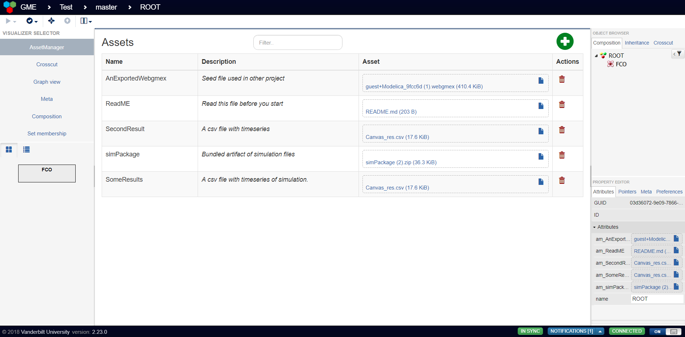

# WebGME Asset Manager Viz

A table-like visualizer for managing blob artifacts on a project basis.



This visualizer deals with asset attributes on the root-node. It filters out attributes based on the prefix `'am_'` and
new assets will have this prefix. Note that these attributes will have the meta-description
property `hidden` set to true and will not show up in the regular attribute editor (starting with webgme v2.24.0).

Since the assets are part of the model - exporting the webgmex will bundle the linked assets.


## Import components into your own webgme repo
Using the [webgme-cli](https://github.com/webgme/webgme-cli) the following pieces can be imported (execute from root of repository).

#### Visualizer
```
webgme import viz AssetManager webgme-asset-manager-viz
```

## Developers

#### Publish new release at npm
 ```
 npm prune
 npm install
 npm version 1.0.0 -m "Release %s"
 git push origin master
 git checkout v1.0.0
 git push origin v1.0.0
 npm publish ./
 ```
